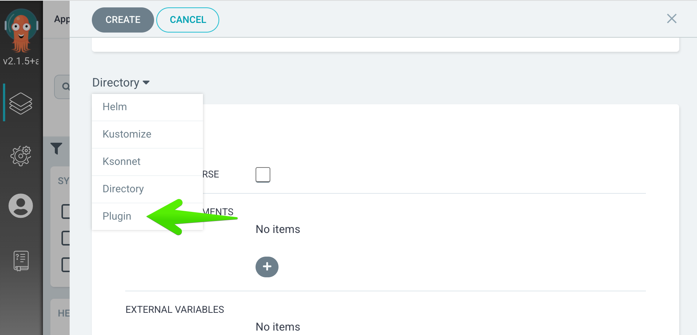
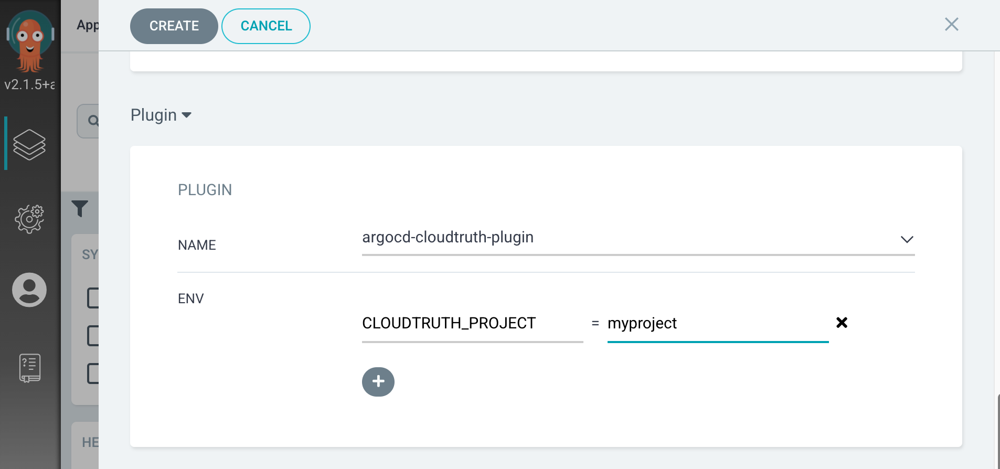

# argocd-cloudtruth-plugin

The CloudTruth configuration management plugin for [ArgoCD](https://argo-cd.readthedocs.io/en/stable/)  When attached to an argocd project, it replaces parameter and secret references (`<parameter_name>`) with the values looked up from CloudTruth.

## Installation

ArgoCD plugin installation is somewhat of a manual process, you can either use the `install/*.yaml` files as a guide, or run `install/setup.sh` to use kubectl patch to apply them:

```shell
curl -s https://raw.githubusercontent.com/cloudtruth/argocd-cloudtruth-plugin/main/install/setup.sh | sh
```
OR
```shell
git clone https://github.com/cloudtruth/argocd-cloudtruth-plugin
./argocd-cloudtruth-plugin/install/setup.sh
```

## Usage

The default installation process adds the following settings to the Secret named argocd-cloudtruth-plugin, and applies them as environment variables to the argocd-repo-server Deployment.  Theses act as defaults for the plugin, and can be overriden in the plugin setup page for each argocd project.

| Parameter | Description | Type | Default | Required |
|-----------|-------------|------|---------|:--------:|
| CLOUDTRUTH_API_KEY | the api key for authenticating to the CloudTruth Rest API | string | n/a | yes |
| CLOUDTRUTH_ENVIRONMENT | the CloudTruth environment to query against | string | `default` | no |
| CLOUDTRUTH_PROJECT | the CloudTruth project to query against | string | `MyFirstProject` | yes |
| CLOUDTRUTH_TAG | the CloudTruth tag to query against | string | `""` | no |
| CLOUDTRUTH_REFERENCE_PATTERN | the pattern that indicates parameter references in the input files | string | `<%s>` | no |
| CLOUDTRUTH_FILE_PATTERN | the file pattern (glob) of the input files | array(string) delim=, | `*.y*ml` | no |

Once the plugin has been installed, you can enable it when creating a new Argo project:



and override the variables needed for that project:



To edit an existing project, visit the plugin settings from the PARAMETERS tab:


Once enabled, the plugin will act upon the yaml files produced by the Argo project, performing substitutions of text like `<PARAMETER_OR_SECRET_NAME>` with the lookup of the value of `PARAMETER_OR_SECRET_NAME` in CloudTruth for the given `CLOUDTRUTH_PROJECT`, `CLOUDTRUTH_ENVIRONMENT` and `CLOUDTRUTH_TAG`

## Argo CD CLI Usage 
### Adding the plugin to existing projects

The [Argo CD cli](https://argo-cd.readthedocs.io/en/stable/getting_started/#2-download-argo-cd-cli) will allow you to add The CLoudTruth plugin to your existing apps.
```shell
argocd app set YOUR_APP --config-management-plugin argocd-cloudtruth-plugin
```

### Override plugin parameters
You can set the plugin environment parameters on [create](https://argo-cd.readthedocs.io/en/stable/user-guide/commands/argocd_app_create/) or [set](https://argo-cd.readthedocs.io/en/stable/user-guide/commands/argocd_app_set/) them after the app is deployed with the ```--plugin-env``` option.  This allows you to change app config settings on the next sync.

**create**
```shell
argocd app create YOUR_APP --repo https://github.com/YOUR_REPO --path YOUR_PATH_IN_REPO --dest-server YOUR_K8S_SERVER --dest-namespace default --config-management-plugin argocd-cloudtruth-plugin --plugin-env CLOUDTRUTH_PROJECT=YOUR_CLOUDTRUTH_PROJECT
```

**set**
```shell
argocd app set YOUR_APP --plugin-env CLOUDTRUTH_PROJECT=YOUR_CLOUDTRUTH_PROJECT
```


## Development

After checking out the repo, run `make`.  To generate new client stubs (vs what is checked in), run `make clean` before running `make`

## Contributing

Bug reports and pull requests are welcome on GitHub at https://github.com/cloudtruth/argocd-cloudtruth-plugin
