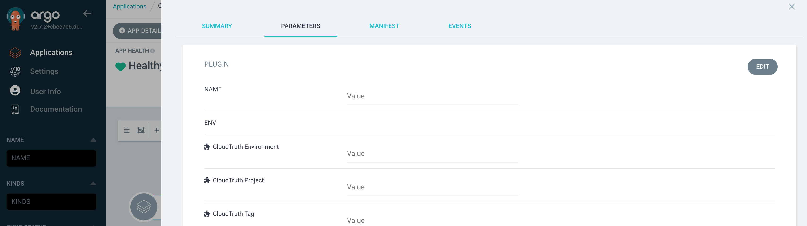

# argocd-cloudtruth-plugin

The CloudTruth configuration management plugin for [ArgoCD](https://argo-cd.readthedocs.io/en/stable/)  When attached to an argocd project, it replaces parameter and secret references (`<parameter_name>`) with the values looked up from CloudTruth.

## Installation

ArgoCD plugin installation is somewhat of a manual process, you can either use the `install/*.yaml` files as a guide, or run `install/setup.sh` to use kubectl patch to apply them:

```shell
curl -s https://raw.githubusercontent.com/cloudtruth/argocd-cloudtruth-plugin/main/install/setup.sh | sh
```
OR
```shell
git clone https://github.com/cloudtruth/argocd-cloudtruth-plugin
./argocd-cloudtruth-plugin/install/setup.sh
```

## Usage

Current versions of this plugin (>= 0.7.0) only support ArgoCD v2.6 and newer due to the changes in the configuration management plugin.  It gets installed as a sidecar container against the `argocd-repo-server`.

After installing the plugin, create the file `.argocd-cloudtruth-plugin` in your Application's repo(+path) to allow this plugin to be used for that Application.  The file can be empty or contain a yaml dictionary to override the plugin's configuration for that repo.  Since this CMP is defined as a sidecar, without creating this file, the plugin can only be enabled for a project by [manually editing the Application manifest](https://argo-cd.readthedocs.io/en/stable/operator-manual/config-management-plugins/#using-a-config-management-plugin-with-an-application).

The configuration for using the plugin can be set and read in one of 4 ways (in order of priority - last wins):
* During install, the `CLOUDTRUTH_*` settings are added to `Secret[argocd-cloudtruth-plugin]` and are made available as system environment variables with an envFrom mount to `argocd-repo-server`.  You can edit the Secret or re-run the installer to change them.
* Application specific settings can be added to the plugin activation file (as yaml) checked into the repo.  The keys in the file get transformed to look like environment variables in order to determine matches for priority, so a key in the file of `cloudtruth-project` will get compared to and override the environment variable `CLOUDTRUTH_PROJECT`
* Plugin specific environment variables can be set as part of its attachment to the argocd Application
* Plugin specific params can be set as part of its attachment to the argocd Application

The settings that control the plugin's behavior area as follows:

| Parameter | Description | Type | Default | Required |
|-----------|-------------|------|---------|:--------:|
| CLOUDTRUTH_API_KEY | the api key for authenticating to the CloudTruth Rest API | string | n/a | yes |
| CLOUDTRUTH_ENVIRONMENT | the CloudTruth environment to query against | string | `default` | no |
| CLOUDTRUTH_PROJECT | the CloudTruth project to query against | string | `MyFirstProject` | yes |
| CLOUDTRUTH_TAG | the CloudTruth tag to query against | string | `""` | no |
| CLOUDTRUTH_REFERENCE_PATTERN | the pattern that indicates parameter references in the input files | string | `<%s>` | no |
| CLOUDTRUTH_FILE_PATTERN | the file pattern (glob) of the input files | array(string) delim=, | `*.y*ml` | no |

Once the plugin has been enabled for an Application, you can change settings by visiting the plugin settings from the PARAMETERS tab in the App Details section of the Application:



Once enabled, the plugin will act upon the yaml files produced by the Argo project, performing substitutions of text like `<PARAMETER_OR_SECRET_NAME>` with the lookup of the value of `PARAMETER_OR_SECRET_NAME` in CloudTruth for the given `CLOUDTRUTH_PROJECT`, `CLOUDTRUTH_ENVIRONMENT` and `CLOUDTRUTH_TAG`

## Argo CD CLI Usage
### Adding the plugin to existing projects

To add The CLoudTruth plugin to your existing Application, create the `.argocd-cloudtruth-plugin` trigger file in your Application's repo and Sync.

### Override plugin parameters
You can set the plugin environment parameters on [create](https://argo-cd.readthedocs.io/en/stable/user-guide/commands/argocd_app_create/) or [set](https://argo-cd.readthedocs.io/en/stable/user-guide/commands/argocd_app_set/) them after the app is deployed with the ```--plugin-env``` option.  This allows you to change app config settings on the next sync.

**create**

Note that one SHOULD NOT provide the `--config-management-plugin` argument, as that only works for the [deprecated ConfigMap structure for plugins](https://argo-cd.readthedocs.io/en/stable/operator-manual/config-management-plugins/#using-a-config-management-plugin-with-an-application)

```shell
argocd app create YOUR_APP --repo https://github.com/YOUR_REPO --path YOUR_PATH_IN_REPO --dest-server YOUR_K8S_SERVER --dest-namespace default --config-management-plugin argocd-cloudtruth-plugin --plugin-env CLOUDTRUTH_PROJECT=YOUR_CLOUDTRUTH_PROJECT
```

**set**
```shell
argocd app set YOUR_APP --plugin-env CLOUDTRUTH_PROJECT=YOUR_CLOUDTRUTH_PROJECT
```

## Development

After checking out the repo, run `make`.  To generate new client stubs, run `make clean` before running `make`

### Developing against a local minikube cluster

In order to build and test the plugin against a local cluster, it needs to be compiled for the correct platform and the sidecar image pushed into the cluster to avoid having to push it to an external image repo.

* Add to argocd-repo-server cloudtruth plugin sidecar manifest: imagePullPolicy: Never
* Run installer (`install/seup.sh`) to add plugin to cluster
* Set minikube docker env:
  ```
  eval $(minikube docker-env)
  ```
* Run docker build against `Dockerfile.dev` within the same terminal as docker env:
  ```
  docker build -t cloudtruth/argocd-cloudtruth-plugin -f Dockerfile.dev .
  ```
* Restart argocd-server:
  ```
  kubectl rollout restart -n argocd deployment/argocd-repo-server
  ```

## Contributing

Bug reports and pull requests are welcome on GitHub at https://github.com/cloudtruth/argocd-cloudtruth-plugin
